<h1 align="center"> Sorteador </h1>

  <a href="#-tecnologias">Tecnologias</a>&nbsp;&nbsp;&nbsp;|&nbsp;&nbsp;&nbsp;
  <a href="#-projeto">Projeto</a>&nbsp;&nbsp;&nbsp;|&nbsp;&nbsp;&nbsp;
  <a href="#-layout">Layout</a>

 

  

## 🚀 Tecnologias

Esse projeto foi desenvolvido com as seguintes tecnologias:

- HTML e CSS
- JavaScript
- Git e Github
- Figma

## 💻 Projeto

O Sorteador é uma aplicação responsiva de um sorteador de números onde o usuário seleciona quantos números quer sortear.

- [Acesse o projeto finalizado, online](https://jonasmaia12.github.io/numbers/)

## 🔖 Layout

Você pode visualizar o layout do projeto através [DESSE LINK](https://www.figma.com/community/file/1397279380752780744). É necessário ter conta no [Figma](https://figma.com) para acessá-lo.
